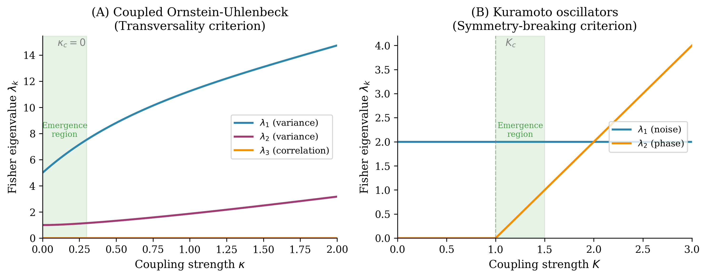
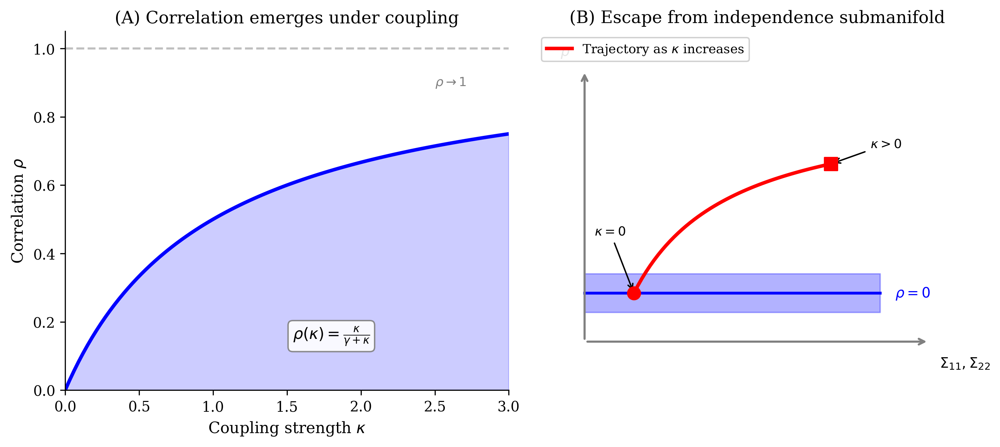

# Manifold Expansion via High-Dimensional Coupling

**When coupled systems escape constraint submanifolds, new statistical coordinates become identifiable.**

[](https://opensource.org/licenses/MIT)
[](https://www.python.org/downloads/)

## Overview

Many information-theoretic bounds assume a fixed statistical model class. This paper identifies a regime where this assumption fails: when high-dimensional systems couple, the identifiable parameter set changes because the **Fisher rank** of the dynamics-to-distribution map increases.

We call this **manifold expansion**: coupling-induced increase in Fisher rank.

**Key equation:** Fisher rank = Jacobian rank of the map F_κ: β → Q_{(κ,β)}

## Key Results

- **Theorem 1**: Provides checkable criteria for rank transitions:
  - *Transversality criterion*: coupling moves the accessible family off a constraint submanifold
  - *Symmetry-breaking criterion*: coupling breaks a group invariance
- **Operational Corollary**: Rank transitions are detectable via Fisher eigenvalue emergence from zero
- **Examples**: Coupled Ornstein-Uhlenbeck (κ_c = 0) and Kuramoto oscillators (K_c > 0)

## Figures

| Figure | Description |
|--------|-------------|
|  | Fisher eigenvalues emerging under coupling |
|  | Manifold expansion geometry |
|  | Correlation emergence in coupled OU |

## Repository Structure

```
manifold-expansion/
├── manifold_expansion_aism.pdf    # Main paper (AISM format)
├── manifold_expansion_aism.tex    # LaTeX source
├── code/
│   └── generate_figures.py        # Figure generation script
├── figures/
│   ├── fig1_eigenvalue_emergence.pdf
│   ├── fig2_geometric_schematic.pdf
│   └── fig3_ou_covariance.pdf
└── README.md
```

## Running the Code

```bash
# Generate all figures
cd code
python3 generate_figures.py
```

**Requirements:** numpy, matplotlib, scipy

## Paper

**Title:** Communication Beyond Information: Manifold Expansion via High-Dimensional Coupling

**Target journal:** Annals of the Institute of Statistical Mathematics

**Status:** In preparation

**Abstract:** Many information-theoretic bounds assume a fixed statistical model class. We identify a regime where this assumption fails: when high-dimensional systems couple, the identifiable parameter set changes because the image rank of the dynamics-to-distribution map changes. We formalize this as *manifold expansion*: coupling-induced increase in Fisher rank. Operationally, this means new score directions become nonzero—statistics that were previously insensitive to parameter variation become informative under coupling.

## Citation

```bibtex
@article{todd2026manifold,
  title={Communication Beyond Information: Manifold Expansion via High-Dimensional Coupling},
  author={Todd, Ian},
  journal={Annals of the Institute of Statistical Mathematics},
  year={2026},
  note={In preparation}
}
```

## Related Work

- [Dimensionality Threshold](https://github.com/todd866/protocell-codes) — Code emergence via effective dimensionality
- [Coherence Dynamics](https://coherencedynamics.com) — Research program overview

## License

MIT License
