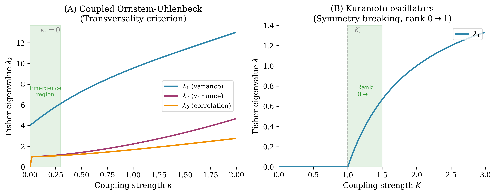

# Coupling-Induced Rank Transitions in Statistical Manifolds

**When does coupling between dynamical systems increase the rank of the Fisher information matrix?**

[](https://opensource.org/licenses/MIT)
[](https://www.python.org/downloads/)

## Overview

Consider a family of dynamical systems parameterized by coupling strength κ and physical parameters β. Each configuration induces a distribution Q on observations. The **dynamics-to-distribution map** F_κ: β → Q determines which distributions are accessible at coupling κ.

**Question:** When does coupling increase rank(dF_κ)?

We provide two checkable criteria: the *transversality criterion* (coupling moves the image off a constraint submanifold) and the *symmetry-breaking criterion* (coupling breaks a group invariance). Since Fisher rank = Jacobian rank (Lemma 1), rank transitions are coordinate-invariant and detectable as eigenvalue emergence in the Fisher information matrix.

## Key Results

- **Theorem 1**: Provides checkable criteria for rank transitions:
  - *Transversality criterion*: coupling moves the accessible family off a constraint submanifold
  - *Symmetry-breaking criterion*: coupling breaks a group invariance
- **Operational Corollary**: Rank transitions are detectable via Fisher eigenvalue emergence from zero
- **Examples**: Coupled Ornstein-Uhlenbeck (κ_c = 0) and Kuramoto oscillators (K_c > 0)

## Figures

| Figure | Description |
|--------|-------------|
|  | Rank transition geometry |
|  | Fisher eigenvalues emerging under coupling |
|  | Correlation coordinate in coupled OU |

## Repository Structure

```
coupling-rank-transitions/
├── coupling_rank_transitions.pdf    # Main paper (AISM format)
├── coupling_rank_transitions.tex    # LaTeX source
├── code/
│   ├── generate_figures.py        # Figure generation script
│   └── operational_validation.py  # Pullback Fisher computation
├── figures/
│   ├── fig1_geometric_schematic.pdf
│   ├── fig2_eigenvalue_emergence.pdf
│   ├── fig3_ou_covariance.pdf
│   └── fig4_operational_validation.pdf
├── requirements.txt
└── README.md
```

## Running the Code

```bash
# Generate schematic figures (Fig 1-3)
cd code
python3 generate_figures.py

# Generate operational validation figure (Fig 4)
# This computes the actual pullback Fisher I_B = J^T g J
python3 operational_validation.py
```

**Requirements:** See `requirements.txt` (numpy, matplotlib, scipy)

## Paper

**Title:** Coupling-Induced Rank Transitions in Statistical Manifolds

**Target journal:** Annals of the Institute of Statistical Mathematics

**Status:** In preparation

**Abstract:** Many information-theoretic bounds assume a fixed statistical model class. We identify a regime where this assumption fails: when high-dimensional systems couple, the identifiable parameter set changes because the image rank of the dynamics-to-distribution map changes. We formalize this as *manifold expansion*: coupling-induced increase in Fisher rank. Operationally, this means new score directions become nonzero—statistics that were previously insensitive to parameter variation become informative under coupling.

## Citation

```bibtex
@article{todd2026coupling,
  title={Coupling-Induced Rank Transitions in Statistical Manifolds},
  author={Todd, Ian},
  journal={Annals of the Institute of Statistical Mathematics},
  year={2026},
  note={In preparation}
}
```

## Related Work

- [Dimensionality Threshold](https://github.com/todd866/protocell-codes) — Code emergence via effective dimensionality
- [Coherence Dynamics](https://coherencedynamics.com) — Research program overview

## License

MIT License
